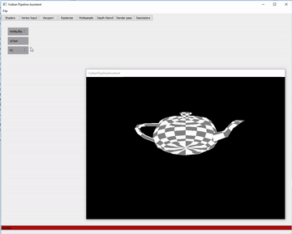
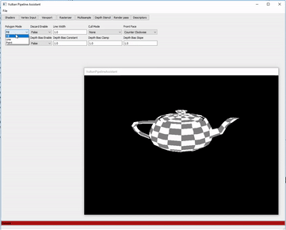
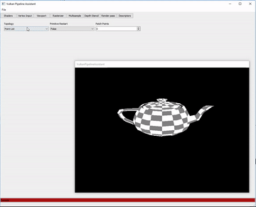

<p align="center"></p>

[](https://trello.com/b/80TA000E/vpa)

## About
VPA is a tool designed to help create Vulkan graphics pipelines through the generation of configuration files and pipeline caches, which can then be used to fill the structs feeding vkCreateGraphicsPipeline in Vulkan.
This tool is also designed to assist in writing and testing glsl shaders by viewing updates to the pipeline config options in real time, with the ability to change uniform variables, textures, and more through the interface and
see it change immediately. No setup of a surrounding engine required! It is intended to be a useful assistative tool for anyone learning about graphics for games as well as small spare-time and indie developers, although anyone is welcome to use it for whatever they need.

Please note that VPA is currently in early development pre-release and is not guaranteed to work in all cases yet. Please see the [Trello](https://trello.com/b/80TA000E/vpa) board for progress.

<p width="100%">



</p>

</br>
</br>
</br>
</br>
</br>
</br>
</br>
</br>
</br>

## Getting the Code
We recomend the QTCreator IDE to edit the code the recomended: [5.14.0](https://download.qt.io/archive/qt/5.14/5.14.0/)
You can clone this repository to your local destination using git:
```
git clone https://github.com/Untitled-Games/Vulkan-Pipeline-Assistant
```

Currently the application only works in 64-bit configurations. Please make sure that you are running the application with 64-bit before submitting a bug report.
Application has only been tested on Windows 10 and may respond differently in a different OS or environment.
In addition, you will need the [Vulkan SDK](https://vulkan.lunarg.com/) installed and hardware capable of supporting Vulkan.


## Github Issues
Please use [Github Issues](https://github.com/Untitled-Games/Vulkan-Pipeline-Assistant/issues) to report bugs.


### Reporting bugs
Please follow these steps to report a bug:

1. **Search for related issues** - Search the existing issues so that you don't create duplicates.

2. **Create a test case** - Please create the smallest isolated test case that you can, that fully reproduces your bug.

3. **Share as much information as possible** - Every little bit of information helps, OS, drivers, all that stuff.


## License 
Vulkan Pipeline Assistant is released under the [MIT](LICENSE) license.
Note, VPA utilizes the [Qt](https://www.qt.io/) library, which includes a [GNU LGPL 3](https://www.gnu.org/licenses/lgpl-3.0.en.html).

## Contributors
### Lead Author
[Ralph Ridley](https://github.com/Qozul)
### Other Contributors
- [Ethan Younger Banks](https://github.com/ThatMathsyBardGuy)
- [Ori Lazar](https://github.com/Kney-Delach)
- [Szymon Jackiewicz](https://github.com/SzyJ)
